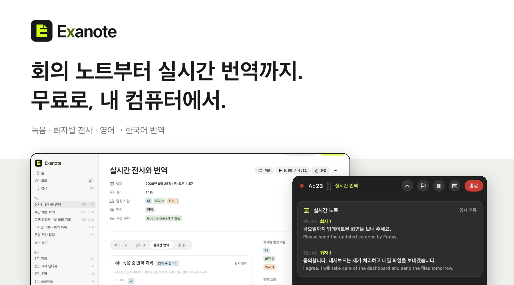
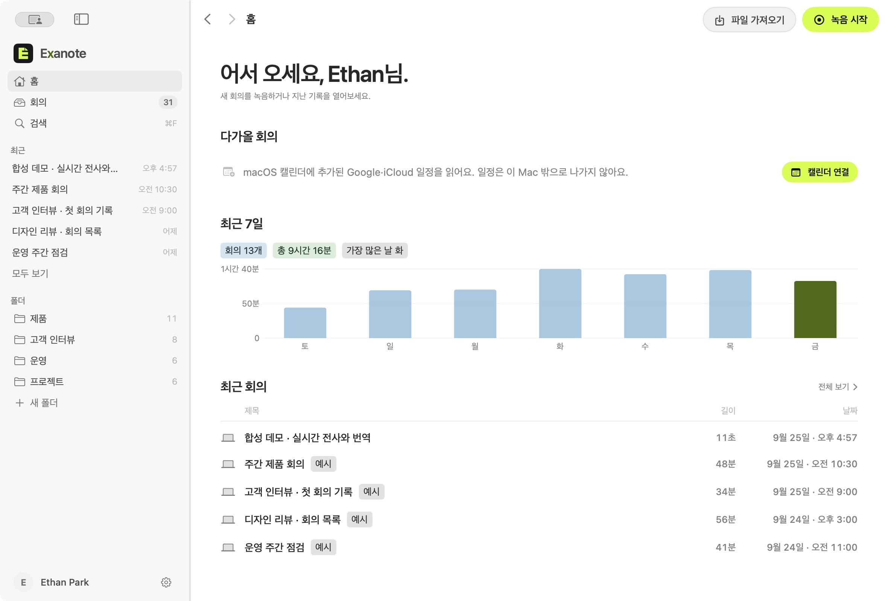
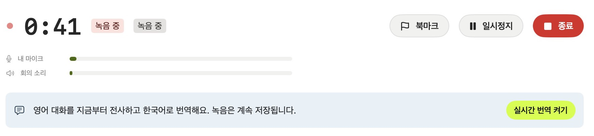
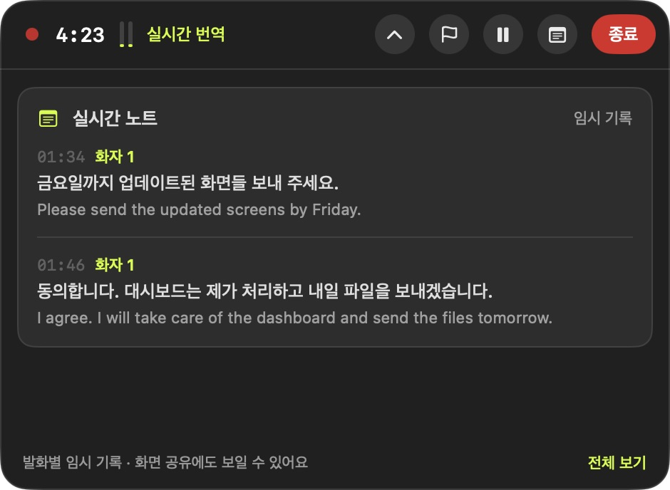
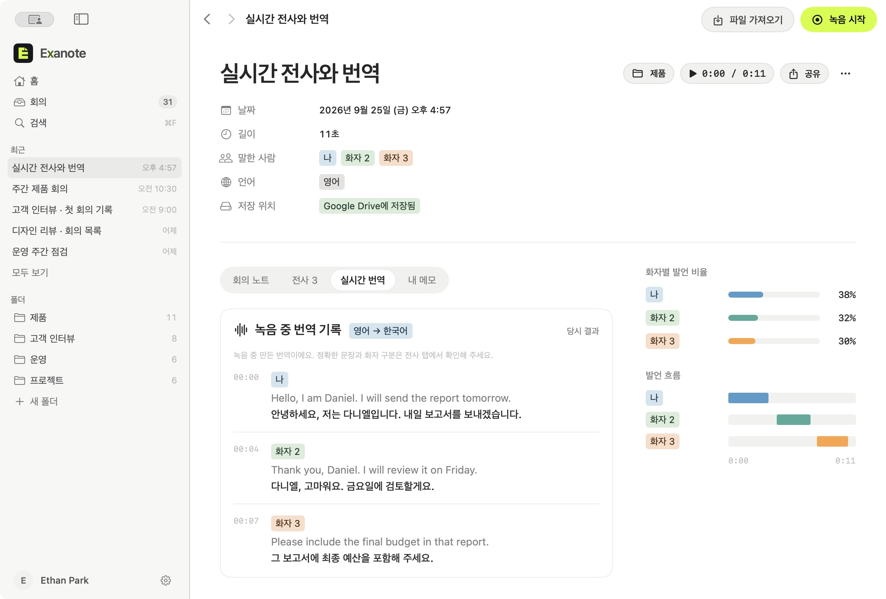

  

  <strong>Exanote는 Mac에서 쓰는 무료 오픈소스 회의 노트 앱입니다.</strong> 
  녹음이나 오디오 파일을 화자별로 전사하고 회의 노트를 만듭니다. 영어 회의는 녹음 중 한국어로 번역해 보여줍니다.

  <a href="#왜-만들었나요">왜 만들었나요</a> ·
  <a href="#설치와-실행">설치와 실행</a> ·
  <a href="#주요-기능">주요 기능</a> ·
  <a href="#성능-측정">성능 측정</a>

## 왜 만들었나요

저는 1인 창업자라 회의 기록 앱이 매일 필요하진 않습니다. 그래도 가끔은 회의에서 누가 무슨 말을 했는지 다시 찾아야 합니다. 그때를 위해 매달 구독료를 내기는 애매했고, 무료로 쓰는 앱은 화자 구분이 빠진 경우가 많았습니다.

마침 NVIDIA의 Nemotron 3 화자 분리 모델이 나와서 직접 만들기 시작했습니다. Exanote는 필요할 때 부담 없이 켜고, 회의 음성을 클라우드에 올리지 않은 채 쓸 수 있는 앱입니다. 한국어 회의를 자주 하는 사람도 염두에 뒀습니다. 무료 오픈소스지만 제가 쓸 앱이라 기능과 사용감은 계속 고치고 있습니다.

## 설치와 실행

Exanote는 **macOS 15 이상을 설치한 Apple Silicon Mac**에서 실행됩니다. 현재는 소스에서 앱을 빌드해 사용할 수 있습니다. 필요한 도구와 실행 명령은 [빌드 안내](docs/development.md)에 정리했습니다.

처음 사용할 때 음성 처리 모델을 내려받습니다. 녹음을 시작하거나, 이미 있는 오디오 파일을 가져오면 됩니다.

## 주요 기능

### 녹음 파일 전사와 화자 구분

회의를 직접 녹음하거나 파일을 가져오세요. Exanote가 발화를 화자별로 나누고 전사와 회의 노트를 만듭니다. 화자 이름은 나중에 바꿀 수 있고, 발화 시각을 누르면 그 부분부터 다시 들을 수 있어요.

### 회의 자동 감지

Zoom, Teams, Slack, FaceTime이나 브라우저에서 통화가 시작되면 녹음을 제안합니다. **녹음은 알림을 눌렀을 때만 시작됩니다.** macOS 캘린더를 연결하면 다가올 회의도 홈에서 볼 수 있어요.

### 실시간 전사와 번역

평소처럼 녹음을 시작한 다음 **실시간 번역 켜기**를 누르면 됩니다. 영어 발화와 한국어 번역이 화자별로 쌓이고, 녹음이 끝난 뒤에도 다시 볼 수 있어요. 현재 지원하는 실시간 번역은 **영어 → 한국어**입니다.

**상단에 띄우기**를 누르면 다른 앱을 보는 동안에도 실시간 노트를 볼 수 있습니다.

녹음 후에는 전사와 번역을 한 화면에서 확인합니다. 녹음 중 보이는 문장은 임시 결과라, 녹음 후 완성되는 전사와 다를 수 있습니다.

### Google Drive로 팀에서 쓰기 (Beta)

팀 폴더를 연결하면 전사와 회의 노트를 Google Drive로 공유할 수 있습니다. **원본 오디오는 각자의 Mac에 남고**, 공유 폴더에는 전사와 노트만 복사됩니다.

## 내 컴퓨터에서 처리합니다

음성 인식, 화자 구분, 번역, 회의 노트 작성은 Mac에서 실행됩니다. Google Drive 공유는 직접 켰을 때만 사용합니다. 모델은 **설정 ▸ AI 모델**에서 설치하거나 지울 수 있어요.

## 성능 측정

Apple M4 · 메모리 32GB Mac에서 한국어 토론 녹음 10개(총 48분 23초)를 전사했습니다.

| 글자 오류율 | Exanote | T사 |
| --- | ---: | ---: |
| 한국어 토론 녹음 | 7.68% | 6.51% |

공백과 문장부호를 제외해 계산했으며, **낮을수록 정확합니다.**

| 처리 및 용량 | 측정값 |
| --- | ---: |
| 48분 23초 분량 전사 | 8분 1초 |
| 약 5분짜리 회의 처리 중 최대 메모리 | 약 4GB |
| 설치 파일 | 약 186MB |
| 설치된 앱 | 약 493MB |
| 음성 처리 모델 | 약 5.3GB |

전사 시간에는 화자 구분과 회의 노트 작성이 포함되지 않습니다. 앱과 모델을 합쳐 약 5.8GB가 필요하며, 녹음 파일은 별도 공간을 사용합니다.

## 개발과 라이선스

[개발 및 빌드 안내](docs/development.md)에서 로컬 실행, 앱 빌드, 명령줄 사용법을 볼 수 있습니다. 앱 코드는 [Apache-2.0](LICENSE) 라이선스를 따르며, 다운로드되는 모델에는 각각의 라이선스가 적용됩니다.
